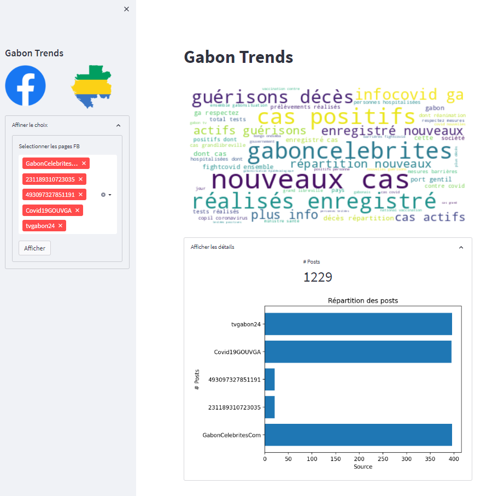

# DEMO Social Media E3MG


<p align="center">
  
 </p>


------------------------


### ⭐ Contexte

Dans le cadre du séminaire Big Data organisé à l 'école des mines de Moanda (E3MG), La DataFoundry, unité Data Science au sein de la Direction de la [Transformation Numérique](https://www.eramet.com/fr/groupe/transformation-numerique) d'[Eramet](https://www.eramet.com/fr), propose un atelier pratique d'analyse de données de réseaux sociaux.

Ce dépôt contient le code source d'une application d'analyse de données Facebook des internautes gabonais.


### 💻 Setup

0 - S'assurer d'avoir installé Python et Conda (gestionnaire d'environnements virtuels).
Si ce n'est pas le cas, installer Python via Miniconda en suivant ces instructions selon votre OS: https://docs.conda.io/en/latest/miniconda.html.

1 - Lancer un terminal miniconda et exécuter les commandes suivantes

a - Cloner ce dépôt Git

```bash
git clone https://github.com/Open-Eramet/demo-social-media-E3MG.git
cd demo-social-media-E3MG
```

b- Créer un environnement virtuel selon requirements.txt. Pour ce faire, 

```bash
conda create -n demo-env python==3.8.10
conda activate demo-env
pip install -r requirements.txt
```

2 - Dans le fichier code/configs.py, mettre ç jour votre chemin de projet dans
```Python
PROJECT_PATH = Path("MON/CHEMIN/PROJET")
```

3 - Exécuter dans le terminal la commande suivante:
```bash
streamlit run code/gabon-trends.py
```


### 📉 Data
Le jeu de données utilisé représente vient de quelques pages populaires au Gabon telles que
 
- https://www.facebook.com/tvgabon24/
- https://www.facebook.com/GabonCelebritesCom/
- https://www.gabonreview.com/tribune-facebook-le-top-10-des-pages-gabonaises-en-mai-2020/"


## 📁 Organisation:
```bash

.
├── README.md
├── assets
│   ├── cookies.json            # Fichier de cookies
│   ├── drapeau-gabon.jpg       # Images de l'app
│   └── logo-facebook.png
├── code                        # Code source de l'app
│   ├── configs.py
│   ├── gabon-trends.py
│   ├── process_data.py
│   ├── scrape_posts.py
│   └── visualize.py
├── data                        
│   ├── processed   
│   │   └── posts.txt           # Données traités
│   └── raw
│       └── posts.json          # Données des posts brut
└── requirements.txt            # Fichiers de prérequis Python à installer


```

Enjoy 👍